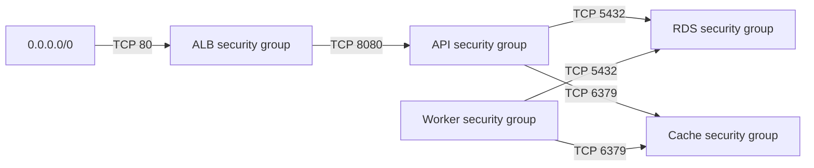

# VPC

## Network

- Create one VPC that is not the default VPC.
- Create at least two distinct public subnets and two distinct private subnets.
  The public subnet set spans at least two availability zones, and the private
  subnet set also spans at least two availability zones.
- Attach an Internet Gateway to the VPC. Every public subnet is associated with
  a route table whose `0.0.0.0/0` route uses that gateway. Private subnets have
  no direct route to the Internet Gateway.
- Create five distinct security groups: ALB, API, workers, RDS and cache.

## Security group ingress

- The ALB group accepts TCP port `80` from `0.0.0.0/0`.
- The API group accepts TCP port `8080` only from the ALB group, with no CIDR
  source.
- The RDS group accepts TCP port `5432` only from the API and worker groups.
- The cache group accepts TCP port `6379` only from the API and worker groups.

The arrows below show the only allowed ingress relationships:

## Exact attachments

The network fields in `manifest.json` are exact attachments, not inventories
of everything created in the VPC:

| Service | Subnets | Security groups |
|---|---|---|
| ALB | Exactly `network.public_subnet_ids` | Only `network.alb_sg_id` |
| ECS API service | Exactly `network.private_subnet_ids` | Only `network.api_sg_id` |
| RDS DB subnet group | Exactly `network.private_subnet_ids` | Only `network.rds_sg_id` |
| Valkey | See the subnet limitation in [`elasticache.md`](elasticache.md) | Only `network.cache_sg_id` |
| Each Lambda worker | Exactly `network.private_subnet_ids` | Only `network.worker_sg_id` |

Do not attach additional security groups to these services. Set RDS
`publicly_accessible = false` and ECS `assign_public_ip = false`.
