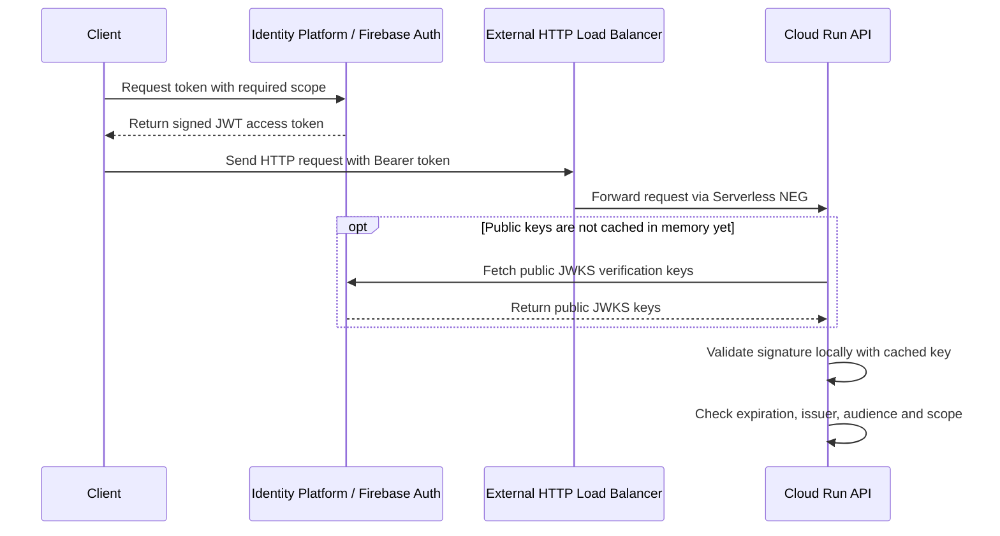
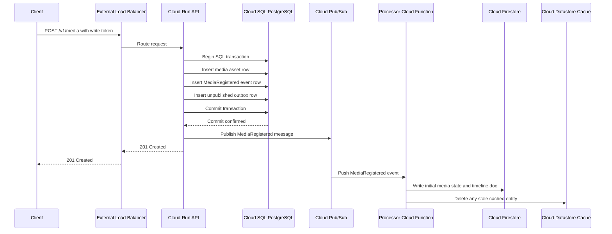
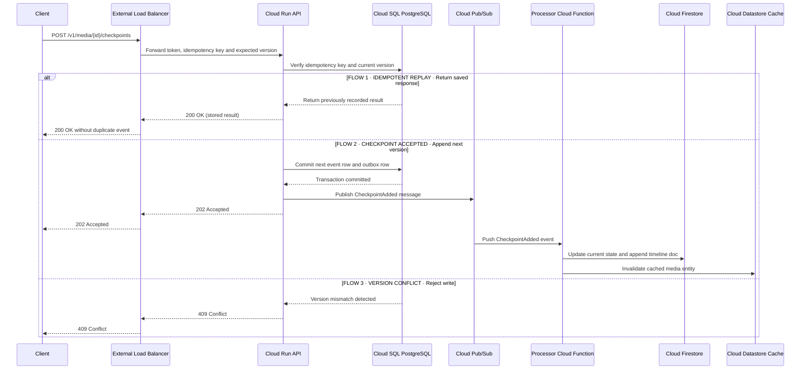
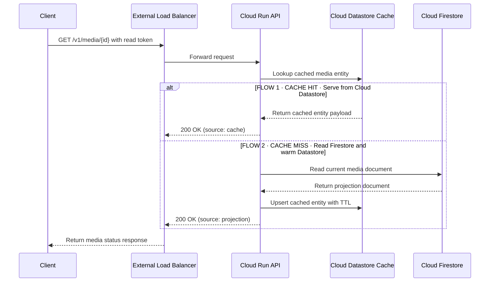
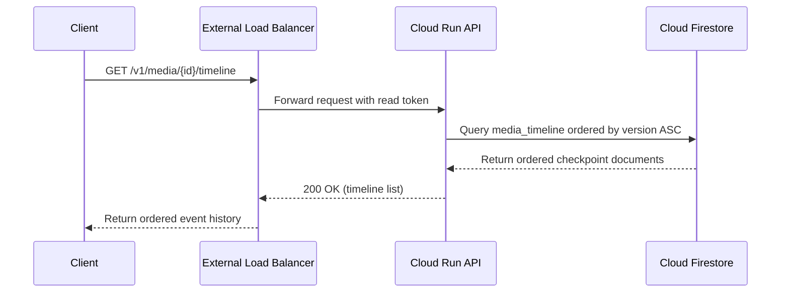
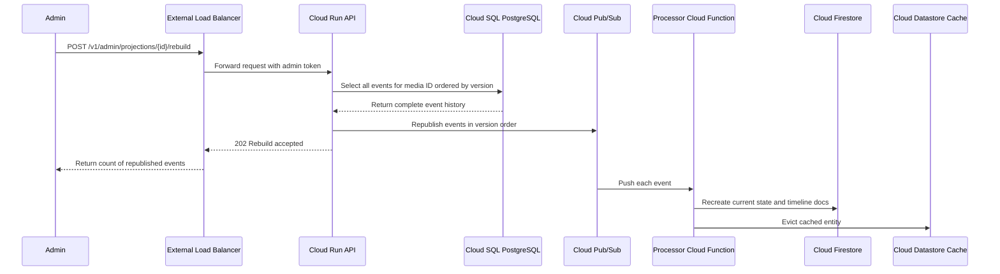
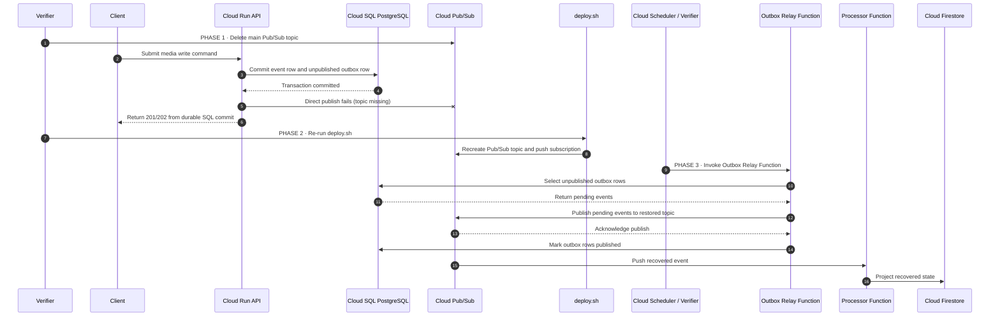
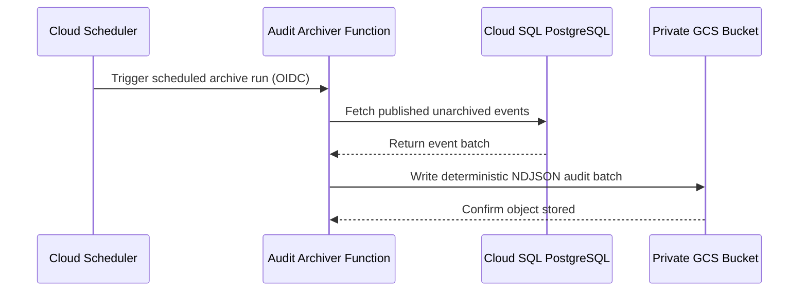

# MediaPulse Ingest

## Introduction

MediaPulse Ingest is a media intake and processing status platform running on a local **Floci-GCP (`http://gcp:4588`)** environment. The HTTP surface is intentionally simple: clients register a new media asset, append processing stage checkpoints (like transcode started, thumbnail extracted, quality check passed), and query either the latest status or the full ordered processing history. I kept the application code small on purpose because the goal here is not testing whether an agent can write Rust HTTP handlers—it is testing whether an agent can wire up a real multi-service Google Cloud architecture using the services emulated by `floci-gcp` so that writes survive pub/sub outages, read projections can be rebuilt from scratch, and every component runs with least-privilege IAM and customer-managed encryption keys.

Even though a basic media tracker could run on a single database, I intentionally designed the stack with separate write and read stores (Cloud SQL for PostgreSQL on the write side, Cloud Firestore for the document read model and ordered timeline, and Cloud Datastore for fast entity caching) plus Secret Manager, Cloud Tasks, BigQuery, an asynchronous outbox relay, and a GCS audit archiver. That forces the model to deal with real GCP cloud engineering problems: configuring custom endpoints against `http://gcp:4588`, Pub/Sub push authentication with OIDC tokens, dead-letter topic policies, and idempotent Terraform re-application after resource deletion.

I supply the application as four pre-built container images so each responsibility stays isolated and gets its own GCP service account:

1. **API image:** serves only the HTTP endpoints. The model must run it on Cloud Run (v2) with at least two minimum instances behind a Global External Application Load Balancer and Serverless NEG.
2. **Processor image:** receives media events pushed from Cloud Pub/Sub, updates the current state and timeline documents in Cloud Firestore, and invalidates stale cached entities in Cloud Datastore. The model runs this as a 2nd-gen Cloud Function triggered by the main Pub/Sub subscription.
3. **Outbox relay image:** scans PostgreSQL for committed outbox events that have not yet been published to Pub/Sub and pushes them out. This runs as a 2nd-gen Cloud Function triggered every minute by Cloud Scheduler.
4. **Audit archiver image:** reads published events from PostgreSQL and writes deterministic NDJSON audit batches into a private Google Cloud Storage bucket backed by a BigQuery audit analytics dataset. This runs as another 2nd-gen Cloud Function invoked on a separate Cloud Scheduler cron job.

Only the Cloud Run API keeps two warm instances up full-time to serve incoming HTTP traffic; the three background workers execute on demand when Pub/Sub or Cloud Scheduler invokes them.

## Infrastructure used

All resources below map directly to the **25 GCP services supported by `floci-gcp` (`http://gcp:4588`)**:

| Cloud service | How it is used in this task |
|---|---|
| **Compute Engine & VPC Networking** | Custom-mode VPC (`google_compute_network`) with an ingress subnet, a private subnet with Private Google Access enabled, and Compute Engine firewall rules (`google_compute_firewall`) isolating port `8080` and PostgreSQL port `5432`. |
| **Global External Application Load Balancer** | Provides the public HTTP entry point (`google_compute_global_forwarding_rule`, `google_compute_target_http_proxy`, `google_compute_url_map`, `google_compute_backend_service`) routing through a Serverless NEG (`google_compute_region_network_endpoint_group`) to Cloud Run. |
| **Cloud Run (v2)** | Docker-backed control plane in `floci-gcp` that keeps at least two warm API container instances (`min_instance_count = 2`) running and replaces unhealthy replicas. |
| **Cloud SQL for PostgreSQL** | Docker-backed PostgreSQL 16 instance in `floci-gcp` acting as the durable system of record for media assets, immutable events, and transactional outbox rows. |
| **Secret Manager** | Stores and versions the PostgreSQL connection credentials (`google_secret_manager_secret` and `google_secret_manager_secret_version`) accessed by the API service account. |
| **Cloud Pub/Sub** | Delivers domain events from the API and outbox relay to the processor worker over gRPC/REST, retries failures with backoff, and routes poison messages to a dead-letter topic after 5 failed delivery attempts. |
| **Cloud Functions (2nd gen)** | Hosts the event processor, outbox relay, and audit archiver workers invoked via Pub/Sub push or Cloud Scheduler HTTP triggers. |
| **Cloud Firestore (Native mode)** | Stores the queryable media state and version-ordered timeline documents (`media_timeline`) used by the read API. |
| **Cloud Datastore** | Acts as the low-latency key-value entity cache in front of Firestore (`DATASTORE_EMULATOR_HOST=gcp:4588`) so repeated reads return cached entities without hitting the projection query path. |
| **Cloud Tasks** | Provides a rate-limited queue (`google_cloud_tasks_queue`) for asynchronous projection rebuild dispatches. |
| **Firebase Auth / Identity Platform & STS** | Issues signed tokens carrying `read`, `write`, and `admin` scopes that the API verifies against the local JWKS endpoint. |
| **Cloud Scheduler** | Triggers the outbox relay every minute (`* * * * *`) and the audit archiver every five minutes (`*/5 * * * *`) using OIDC service account tokens. |
| **Google Cloud Storage (GCS) & BigQuery** | Stores private, object-versioned NDJSON audit files in GCS (`google_storage_bucket`) paired with an encrypted BigQuery analytics dataset (`google_bigquery_dataset` and `google_bigquery_table`). |
| **Cloud IAM & Service Account Credentials** | Assigns a dedicated service account (`google_service_account`) and signing keys (`google_service_account_key`) to each component following least privilege. |
| **Cloud KMS** | Supplies a KeyRing (`google_kms_key_ring`) and four separate customer-managed encryption keys (`google_kms_crypto_key`) for Cloud SQL, Pub/Sub, Firestore/Datastore, and GCS/BigQuery audit data. |
| **Cloud Logging & Cloud Monitoring** | Collects structured logs into 14-day retention buckets (`google_logging_project_bucket_config`, `google_logging_project_sink`) and configures operational alert channels (`google_monitoring_notification_channel`). |

## Operational flows

Each diagram below walks through one end-to-end flow across the platform and shows only the services involved in that specific path.

### 1. Authenticate and reach the API

Every protected endpoint requires a signed JWT bearing the right scope (`read`, `write`, or `admin`). The client requests a token from Identity Platform / Firebase Auth, then sends the HTTP request to the Global External Application Load Balancer. The load balancer forwards the call through the Serverless NEG to a warm Cloud Run API instance. If the API instance has not cached the public signing keys yet, it fetches the JWKS document once, verifies the signature, issuer, audience, expiration, and scope locally, and then processes the request.

### 2. Register a new media item

When a client calls `POST /v1/media`, the API opens a single PostgreSQL transaction in Cloud SQL and inserts three rows together:

1. The **media row** containing the asset ID, uploader owner, source URI, target profile, and initial version (`1`).
2. The **event row** recording the immutable `MediaRegistered` domain event.
3. The **outbox row** holding the serialized event payload and `published = false`.

Because all three inserts happen inside one database transaction, Cloud SQL either commits all three or rolls back all three. We never end up with an accepted media asset that is missing from the outbox. Right after the commit succeeds, the API does a best-effort publish to Cloud Pub/Sub and returns `201 Created`, while the Processor Cloud Function updates Firestore and clears the Cloud Datastore entity cache asynchronously.

### 3. Append a processing checkpoint

Adding a processing checkpoint (for example, `TranscodeCompleted` or `AudioNormalized`) never overwrites prior history; it appends the next versioned event. The client supplies an `Idempotency-Key` header along with the `expected_version`. Inside Cloud SQL, the API checks whether that idempotency key was already processed and whether the current version matches `expected_version`.

That gives us three possible outcomes on any checkpoint call: an idempotent replay returning the stored response without creating a duplicate event, a clean version increment that commits and publishes `CheckpointAdded`, or a `409 Conflict` when another writer already advanced the version.

### 4. Read current media state

When a client fetches `GET /v1/media/{id}`, the Cloud Run API checks the Cloud Datastore entity cache first. If the entity key is present and unexpired, it returns immediately with `source: "cache"`. On a cache miss, the API reads the current projection document from Cloud Firestore, writes a cached entity into Cloud Datastore with an expiration timestamp so subsequent calls hit the cache, and returns the payload with `source: "projection"`. Cloud SQL is intentionally kept off the hot read path.

### 5. Read the media processing timeline

The timeline endpoint (`GET /v1/media/{id}/timeline`) returns every checkpoint in ascending version order. Because Cloud Datastore only caches the latest snapshot for a media item, timeline queries go straight to the `media_timeline` collection in Cloud Firestore ordered by `version`.

### 6. Rebuild a corrupted or deleted Firestore projection

If someone deletes or corrupts the read model in Cloud Firestore, an operator with an `admin` token can call `POST /v1/admin/projections/{id}/rebuild`. The API queries the immutable event table in Cloud SQL for that media ID ordered by version, enqueues rebuild tasks / republishes every event to Cloud Pub/Sub, and lets the Processor Cloud Function reconstruct the Firestore documents and evict the Cloud Datastore cache.

### 7. Recover writes accepted during a Pub/Sub outage

If the Cloud Pub/Sub topic is missing or unreachable when a client submits a write, the API still succeeds because the event and outbox row are safely committed inside Cloud SQL. Recovery runs across three distinct steps:

1. **Induce the fault:** the verifier deletes the main Pub/Sub topic and sends a new media command. The API commits the transaction to Cloud SQL, logs the failed immediate publish, and returns success to the caller.
2. **Repair the stack:** the verifier executes `deploy.sh` again, which reconciles Terraform state and recreates the missing Pub/Sub topic and subscription wiring.
3. **Flush the outbox:** Cloud Scheduler (or the verifier trigger) invokes the Outbox Relay Cloud Function, which queries unpublished rows from Cloud SQL, publishes them to the restored Pub/Sub topic, marks them published, and allows the Processor Function to catch Firestore up.

### 8. Archive published events to Google Cloud Storage

On a separate 5-minute Cloud Scheduler cron job, the Audit Archiver Cloud Function queries Cloud SQL for published events that have not been archived yet, bundles them into a deterministic NDJSON file under `events/`, uploads the object into the CMEK-encrypted private GCS bucket, and records the archive timestamp in PostgreSQL.

## Score

The verifier grades the deployment across **19 test blocks** grouped into **six categories** totaling **100 points**. A submission only passes when it achieves the full **100 / 100** score and satisfies all hard gates.

| Category | Points |
|---|---:|
| Core product behavior | 24 |
| Recovery | 20 |
| Architecture and deployment | 17 |
| Lifecycle | 15 |
| Asynchronous processing | 13 |
| Security and observability | 11 |
| **Total** | **100** |

Here is what each scored test block verifies and how points are assigned:

| Category | Scored test block | What its experiments prove | Points |
|---|---|---|---:|
| Core product behavior | Media workflow | Newly created media items and processing checkpoints stay ordered, complete, and reachable through the External Load Balancer across warm Cloud Run instances. | 9 |
| Core product behavior | Projection and cache | A cold read queries Cloud Firestore, populates the Cloud Datastore entity cache, and serves the next read directly from cache. | 7 |
| Core product behavior | Idempotency and concurrency | Retried requests with the same idempotency key produce only one event, and concurrent updates with stale expected versions are rejected with HTTP 409. | 8 |
| Recovery | Outbox recovery | Media writes accepted while the Pub/Sub topic is deleted still reach Cloud Firestore once `deploy.sh` restores the topic and the outbox relay runs. | 6 |
| Recovery | Projection rebuild | When documents are wiped from Cloud Firestore, calling the admin rebuild endpoint replays the history from Cloud SQL and restores the exact version and timeline. | 5 |
| Recovery | Cloud Run instance recovery | Terminating or cycling an active API instance keeps traffic healthy across the minimum two Cloud Run instances without dropping readable data. | 5 |
| Recovery | Cloud SQL restart recovery | Restarting the Cloud SQL PostgreSQL instance preserves all previously committed media assets and outbox state once the database comes back up. | 4 |
| Architecture and deployment | Infrastructure managed with Terraform or OpenTofu | `terraform validate` succeeds and `infra/terraform.tfstate` manages every required Floci-GCP resource family without out-of-band CLI resources. | 3 |
| Architecture and deployment | Declared compute and ingress | State declares the Global External HTTP Load Balancer, Serverless NEG, and Cloud Run API service with `min_instance_count >= 2` and the supplied `api_image`. | 2 |
| Architecture and deployment | Declared data and messaging | State declares Cloud SQL PostgreSQL, Secret Manager, Cloud Pub/Sub main and DLQ topics/subscriptions, Cloud Tasks, Cloud Firestore, BigQuery dataset, GCS audit bucket, and the three 2nd-gen Cloud Functions. | 2 |
| Architecture and deployment | Live ingress and compute | Live Floci-GCP API checks confirm the External Load Balancer forwarding rule, Serverless NEG, and healthy Cloud Run revision are active and routing traffic. | 5 |
| Architecture and deployment | Live data and event graph | Live checks confirm Cloud SQL, Secret Manager, Firestore, Datastore, Pub/Sub subscriptions, Cloud Scheduler jobs, and the private GCS bucket are reachable and wired together. | 5 |
| Lifecycle | Stable deployment | Running `deploy.sh` a second time converges cleanly without replacing the Cloud SQL instance or wiping existing media records. | 7 |
| Lifecycle | Clean destroy | Running `destroy.sh` deletes every resource tagged/prefixed for the current trial while leaving baseline project resources untouched. | 8 |
| Asynchronous processing | Backlog recovery | When push delivery from Pub/Sub to the Processor Function is paused, accepted events queue up in the subscription and project cleanly in order once delivery resumes. | 7 |
| Asynchronous processing | Duplicate and invalid messages | Duplicate event deliveries remain idempotent in Firestore, while malformed payloads are routed to the Pub/Sub dead-letter topic after max retries without blocking valid events. | 6 |
| Security and observability | Declared security | State defines the custom VPC, private subnet, Compute Engine firewall rules, dedicated per-component Service Accounts, four Cloud KMS CMEKs, and 14-day Cloud Logging buckets. | 3 |
| Security and observability | Live security graph | Live inspection verifies private IP isolation on Cloud SQL, Identity Platform / Firebase Auth JWT configuration, CMEK bindings, and separate IAM service accounts. | 5 |
| Security and observability | Authorization, audit and logs | `read`, `write`, and `admin` tokens are enforced on every route, the archiver writes valid NDJSON batches to GCS, and Cloud Logging buckets contain no plaintext database passwords or private keys. | 3 |
| **Total** |  |  | **100** |

### Hard Gates and Score Caps

In addition to the point weights above, the verifier enforces three score caps if critical invariants are violated during testing:
- **Accepted write loss or corruption (`score cap: 49`)**: Triggered if any media creation or checkpoint write that returned HTTP `201`/`202` is permanently lost or corrupted in PostgreSQL or the rebuilt projection.
- **Critical authorization escalation (`score cap: 49`)**: Triggered if an unauthenticated request or a `read`-only token is allowed to mutate media state or invoke the `/v1/admin/` rebuild route.
- **Teardown resource leak (`score cap: 79`)**: Triggered if `destroy.sh` leaves behind trial resources in Terraform state or the cloud project, or damages pre-existing baseline resources.
